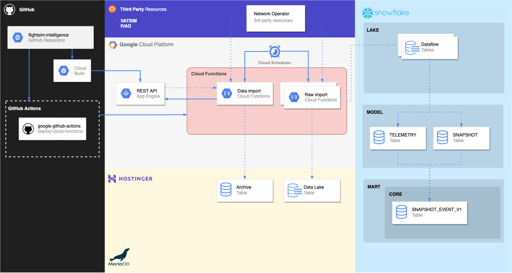
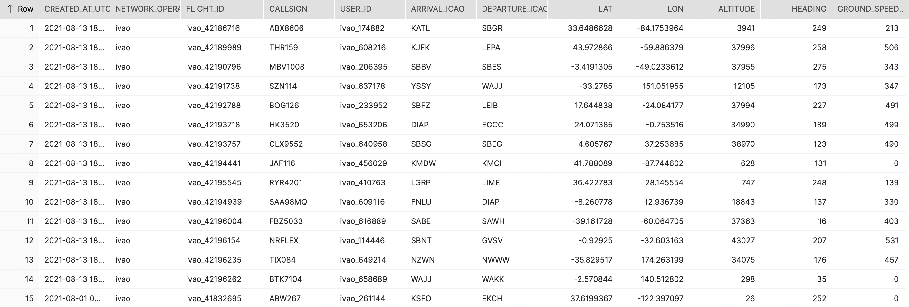

# flightsim-intelligence
A personal playground/training project using:


A flightsim intelligence service developed by Alexander Viala Bellander.

The system collects telemetry and server status data from Flightsim Network Operators for business intellegence and educational purposes. Intelligence reports were to be created weekly.

This project is not commercial and was created as a learning project on how to establish certain cloud infrastructure and minimise cost.

## system architecture


## database cost
With `INSERT` operations occuring every hour `0 * * * *` and a `AUTO_SUSPENSION = 180` the daily operating cost amounted to ~1.30 credits.
Without analysis and storage costs this amounts to a monthly operating cost of ~39 credits or ~85 EUR

## learnings and proposed changes
I realised that what we would have liked is to use snowflake staging and pipelines to reduce cost. Instead of inserting data hourly we could upload the json documents to a Google Cloud Storage Bucket and use it as a stage environment in snowflake. Then have a pipeline operating on the documents weekly.

Similarly we could upload the documents to GCS (or other cloud storage) and run a Cloud Function (FaaS) that fetches the data in the bucket and inserts it to the database weekly.

These options would likely reduce operating costs since storage is much less expensive than having to operate the database hourly.


## analysis results


## sql and tables
Below are snippets of SQL and table examples to better understand the underlying data and its transformation. The data fetched from the Network Operators were large JSON documents with different schemas, however, with similar content; such as: `altitude`, `true heading`, `latitude`, `longitude`, etc.

The SQL syntax follows `SnowSQL`

### LAKE.DATAFLOW.IVAO
The source data can be found at:
IVAO: https://api.ivao.aero/v2/tracker/whazzup
VATSIM: https://map.vatsim.net/livedata/live.json

Offline examples can be found at:
[IVAO](sql/snowflake/table_examples/ivao_feed_data.json)
[VATSIM](sql/snowflake/table_examples/vatsim_feed_data.json)


___

### MODEL.IVAO.DATAFLOW_SNAPSHOT
We flatten the json data loaded into the lake into rows. No data validation is made.
Documentation: https://docs.snowflake.com/en/sql-reference/functions/flatten.html

We define table columns from recurring keys in the json document.


<details>
<summary>Click to see SQL</summary>

```sql
create or replace view MODEL.IVAO.DATAFLOW_SNAPSHOT as (
    select 
        value:callsign::varchar callsign,
        insert_at as created_at,
        value:flightPlan:arrivalId::varchar arrival_icao,
        value:flightPlan:departureId::varchar dep_icao,
        value:lastTrack:latitude::float lat,
        value:lastTrack:longitude::float lon,
        value:lastTrack:altitude::number altitude,
        value:lastTrack:heading::number heading,
        value:lastTrack:groundSpeed::number ground_speed,
        value:id::varchar id,
        value:lastTrack last_track_obj,
        value:pilotSession pilot_session_obj,
        value:rating::int rating,
        value:serverId::varchar server_id,
        value:softwareTypeId::varchar software_type_id,
        value:softwareVersion::varchar software_version,
        value:time::int time,
        value:userId::int user_id
    from lake.dataflow.ivao, lateral flatten( input => payload::variant::object:payload:clients:pilots) vm
);
```

</details>

### MODEL.VATSIM.TELEMETRY
We flatten the json data loaded into the lake into rows. No data validation is made.
Documentation: https://docs.snowflake.com/en/sql-reference/functions/flatten.html

We define table columns from recurring keys in the json document.


<details>
<summary>Click to see SQL</summary>

```sql
create or replace view MODEL.VATSIM.TELEMETRY as (
    select 
        insert_at, 
        value:uid::varchar flight_id,
        value:cid::varchar user_id,
        value:name::varchar user_name,
        value:rating::varchar user_rating,
        value:callsign::varchar callsign,
        value:aircraft::varchar aircraft_type, 
        value:arr::varchar arrival_icao,
        value:dep::varchar dep_icao, 
        value:alt::varchar::int altitude, 
        value:crzalt::varchar cruise_altitude,
        value:gndspd::varchar::int ground_speed,
        value:hdg::varchar::int heading,
        value:lat::varchar lat,
        value:lon::varchar lon,
        value:route::varchar route
    from lake.dataflow.vatsim, lateral flatten( input => payload::variant::object:payload ) vm
);
```

</details>

___

### MART.CORE.SNAPSHOT_EVENT_V1



<details>
<summary>Click to see SQL</summary>

```sql
create or replace view MART.CORE.SNAPSHOT_EVENT_V1 as (
    select 
        convert_timezone('UTC', created_at)::timestamp_ntz(0) as created_at_utc,
        'ivao' as network_operator,
        'ivao_' || id as flight_id,
        callsign,
        'ivao_' || user_id as user_id,
        arrival_icao,
        dep_icao as departure_icao,
        lat,
        lon,
        altitude,
        heading,
        ground_speed
    from 
        model.ivao.dataflow_snapshot
    union
    select
        convert_timezone('UTC', insert_at)::timestamp_ntz(0) as created_at_utc,
        'vatsim' as network_operator,
        'vatsim_' || flight_id as flight_id,
        callsign,
        'vatsim_' || user_id as user_id,
        arrival_icao,
        dep_icao as departure_icao,
        lat::float,
        lon::float,
        altitude,
        heading,
        ground_speed
    from
        model.vatsim.telemetry
);
```

</details>

## copyright
Copyright Alexander Viala Bellander 2021 © 
All rights reserved.
